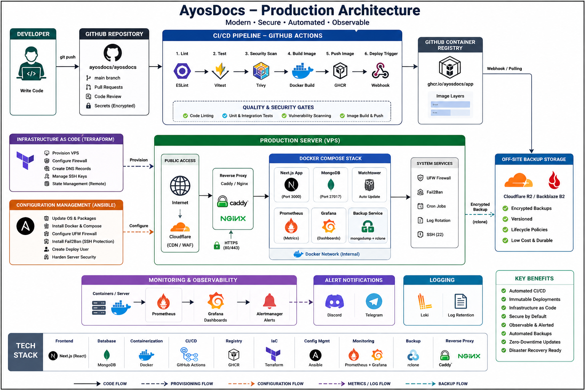

# AyosDocs

AyosDocs is a full-stack web application designed to help Filipinos navigate government documentation and applications through interactive, step-by-step guides.

**Visit the live site: [ayosdocs.com](https://ayosdocs.com)**

## 🚀 Features

- **Interactive Guides:** Step-by-step requirements, fees, and procedures for major government documents (Passport, NBI, SSS, etc.).
- **Personal Progress Tracker:** Save your progress and track completed requirements.
- **Requirement Bundles:** Grouped guides for specific life events like "Starting a Business" or "Getting Married".
- **Office Directory & Ratings:** Crowdsourced insights on government office waiting times and service quality.

## 🏗️ Architecture

<div align="center">
  
</div>

## 📂 Project Structure

```text
ayosdocs/
├── app/               # Next.js Application (standalone build)
├── docs/              # Architecture, Runbooks, and Guides
├── infra/             # Terraform (IaC) and Ansible (Config)
├── docker/            # Docker Compose, Nginx, and Monitoring
├── cloudflare/        # Cloudflare Tunnel configuration
├── Makefile           # Task automation
└── package.json       # Root workspace configuration
```

## 🛠️ Tech Stack

- **Framework:** Next.js 16 (App Router)
- **Styling:** Tailwind CSS 4
- **Database:** MongoDB
- **Proxy:** Nginx
- **Infrastructure:** Terraform, Ansible, Docker
- **Connectivity:** Cloudflare Tunnel

## 📦 Getting Started

### Prerequisites

- Node.js 20+
- Docker & Docker Compose
- MongoDB (local or via Docker)

### Installation

1. **Clone the repository:**
   ```bash
   git clone https://github.com/mmoriones/ayosdocs.git
   cd ayosdocs
   ```

2. **Install dependencies:**
   ```bash
   npm install
   ```

3. **Configure Environment Variables:**
   AyosDocs uses **Ansible Vault** to manage secrets. 
   
   - Edit your secrets in `infra/ansible/vars/secrets.yml`.
   - Run the setup script to generate local environment files:
   ```bash
   npm run setup-env
   ```
   *This will create `app/.env.local` and `app/.env.tunnel` using the encrypted variables.*

## 🚢 Deployment & Infrastructure

For detailed instructions on how to provision a fresh server and deploy the application, see our **[Deployment Guide](docs/DEPLOYMENT.md)**.

### Quick Start (Server Setup)
1. Install Ansible locally.
2. Edit `infra/ansible/vars/secrets.yml` and `infra/ansible/inventory.ini`.
3. Run:
   ```bash
   ansible-playbook -i infra/ansible/inventory.ini infra/ansible/setup-server.yml --ask-vault-pass
   ```
   *Note: This will automatically clone and sync the repository on your server.*

## 🛠️ Development & Deployment

This project uses a `Makefile` to simplify common tasks.

### Local Development
```bash
# Start Next.js in dev mode
make dev
```

### Docker Deployment (VM/VPS)
```bash
# Build and start the full stack (App + Nginx + MongoDB)
make docker-up

# Stop the stack
make docker-down
```

### Infrastructure (Planned)
```bash
# Apply Terraform changes
make infra-up
```


