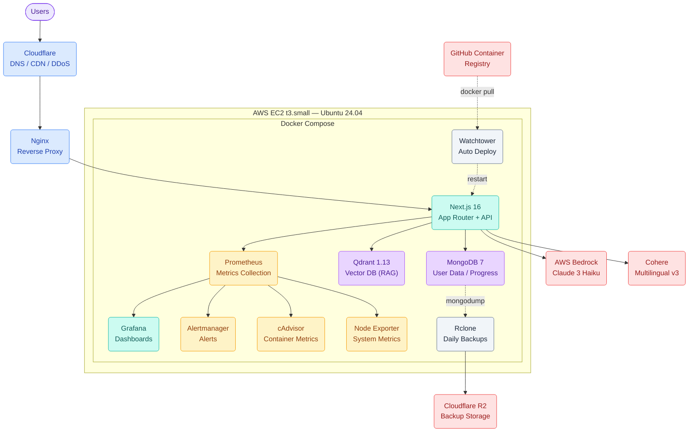

<div align="center">
 
 <h1>AyosDocs</h1>
 <p>Helping Filipinos navigate government bureaucracy through interactive, step-by-step guides.</p>
 <a href="https://ayosdocs.com"><strong>Visit Live Site »</strong></a>
 <br />
 <br />
 
 
 
 
 
 
 
 
</div>

---

## What is AyosDocs?

AyosDocs is a full-stack workflow platform designed to simplify the complex world of Philippine government documentation. From getting your first Passport to starting a business, we provide the roadmap to get it done without the headache.

### Key Features

- **Interactive Guides:** Comprehensive requirements, fees, and procedures for NBI, SSS, DFA, and more.
- **Progress Tracking:** Interactive checklists that save your progress as you complete requirements.
- **Life Event Bundles:** Grouped requirements for goals like "Starting a Business" or "Getting Married".
- **AI Assistant:** Ask questions about any guide via chat — powered by Claude 3 Haiku on AWS Bedrock with RAG over Qdrant vector database.
- **Real-time Monitoring:** Built-in observability stack to ensure 99.9% uptime and performance tracking.

---

## Tech Stack

| Layer | Technology |
| :--- | :--- |
| **Frontend** | [Next.js 16](https://nextjs.org/) (App Router), [Tailwind CSS 4](https://tailwindcss.com/) |
| **Backend** | Next.js Server Actions & API Routes |
| **Database** | [MongoDB](https://www.mongodb.com/) (Mongoose), [Qdrant](https://qdrant.tech/) (Vector DB) |
| **AI / ML** | [AWS Bedrock](https://aws.amazon.com/bedrock/) (Claude 3 Haiku), [Cohere Embed Multilingual v3](https://cohere.com/embed) |
| **Infrastructure** | [Terraform](https://www.terraform.io/) (AWS EC2 + Cloudflare), [Ansible](https://www.ansible.com/) |
| **Monitoring** | [Prometheus](https://prometheus.io/), [Grafana](https://grafana.com/), cAdvisor, Alertmanager |
| **Deployment** | Docker & Docker Compose, Watchtower (auto-updates), GitHub Container Registry |

---

## Architecture

AyosDocs runs on a single **AWS EC2 t3.small** instance behind **Cloudflare** proxy. The stack is fully containerized with Docker Compose:

- **Next.js** serves both the frontend and API routes
- **Nginx** acts as reverse proxy
- **MongoDB** stores user data, progress, and favorites
- **Qdrant** stores guide embeddings for RAG-based AI search
- **Claude 3 Haiku** (Bedrock) generates chat responses
- **Prometheus + Grafana** provide observability
- **Rclone** backs up data to Cloudflare R2 daily



---

## Getting Started

### 1. Prerequisites
- **Node.js** 22+
- **Docker & Compose**
- **Terraform & Ansible** (for infrastructure)
- **AWS credentials** (for Bedrock, Qdrant)

### 2. Quick Installation
```bash
# Clone the repository
git clone https://github.com/mmoriones/ayosdocs.git
cd ayosdocs

# Install dependencies
npm install

# Setup local environment (requires Ansible Vault password)
npm run setup-env
```

### 3. Provision & Deploy
For a detailed end-to-end guide on provisioning AWS and deploying the stack, see our **[Deployment Guide](docs/DEPLOYMENT.md)**.

```bash
# Bootstrap remote state (first time only)
make infra-bootstrap

# Provision infrastructure (Terraform + Ansible)
make infra-up && make infra-provision

# Launch the stack and index AI guides
make remote-docker-minimal-build && make remote-ai-sync
```

---

## Monitoring & Maintenance

The platform is fully containerized with built-in observability — automated health monitoring, metric collection, alerting, and daily encrypted backups to Cloudflare R2. The monitoring stack (Prometheus + Grafana + Alertmanager) runs alongside the application for real-time visibility.

For operational details, see the [Runbook](docs/RUNBOOK.md) and [Disaster Recovery Plan](docs/DISASTER_RECOVERY.md).

---

## Project Roadmap

AyosDocs is actively developed with these focus areas:

- **Content Expansion** — Adding more government agency guides, life event bundles, and localized content for regions across the Philippines.
- **Mobile Experience** — Improving responsive design, touch interactions, and progressive web app capabilities for on-the-go access.
- **Community Contributions** — Building a workflow for community-authored guides with review and moderation.
- **AI Assistant** — Enhancing the RAG-based chat with better context awareness and support for follow-up questions.
- **Performance & Reliability** — Ongoing infrastructure hardening, edge caching, and observability improvements.

---

## Tech Grid

| Category | Technologies |
| :--- | :--- |
| **Frontend** |     |
| **Backend** |    |
| **Databases** |    |
| **AI / ML** |    |
| **Infrastructure** |      |
| **Monitoring** |     |
| **CI / CD** |     |
| **Backup** |   |
